***

# Table of Contents

### Exceptions Handling in Java
- [What are exceptions?](#what-are-exceptions)
- [When Can Exceptions Occur?](#when-can-exceptions-occur)
- [Types of Exceptions in Java](#types-of-exceptions-in-java)
- [What is throw?](#what-is-throw)
- [What is throws?](#what-is-throws)
- [What is finally?](#what-is-finally)
- [What are Custom Exceptions?](#what-are-custom-exceptions)
- [What are Multiple Catch Blocks?](#what-are-multiple-catch-blocks)
- [Why is Exception Handling Important?](#why-is-exception-handling-important)
- [try-catch-finally Explained](#try-catch-finally-explained)
- [Checked vs Unchecked Exceptions](#checked-vs-unchecked-exceptions)
- [Throw vs throws](#throw-vs-throws)
- [What throws Actually Does](#what-throws-actually-does)

---

### Multithreading
- [What is Multithreading?](#what-is-multithreading)
- [How is Multithreading implemented in Java?](#how-is-multithreading-implemented-in-java)
- [What is synchronization in multi-threading in java ?](#what-is-synchronization-in-multi-threading-in-java)
- [How to implement synchronization in Java?](#how-to-implement-synchronization-in-java)
- [What is Inter-Thread Communication?](#what-is-inter-thread-communication)
- [Java Methods for Inter-thread Communication](#java-methods-for-inter-thread-communication)

---

### Inheritance
- [What is Inheritance?](#what-is-inheritance)
- [Why is inheritance useful?](#why-is-inheritance-useful)
- [Features of Inheritance](#features-of-inheritance)
- [Extends keyword](#extends-keyword)
- [super keyword](#super-keyword)
- [Types of Inheritance](#types-of-inheritance)

---

### Polymorphism
- [What is Polymorphism?](#what-is-polymorphism)
- [Types of Polymorphism in Java](#types-of-polymorphism-in-java)

---

### Abstraction
- [What is an Interface in Java?](#what-is-an-interface-in-java)
- [Difference between class an Interface](#difference-between-class-an-interface)
- [How are abstract classes different from regular classes?](#how-are-abstract-classes-different-from-regular-classes)
- [Difference between Abstract Class and Interface](#difference-between-abstract-class-and-interface)
- [Why Multiple Inheritance is not supported directly in Java?](#why-multiple-inheritance-is-not-supported-directly-in-java)
- [How to Implement Multiple Inheritance using Interfaces?](#how-to-implement-multiple-inheritance-using-interfaces)
- [Example of abstract class](#example-of-abstract-class)

---

### File handling
- [What is File Handling?](#what-is-file-handling)
- [Real life examples of file handling](#real-life-examples-of-file-handling)
- [How is File Handling done in Java?](#how-is-file-handling-done-in-java)
- [Basic File Handling Operations](#basic-file-handling-operations)
- [Example Programs](#example-programs)

### Advanced File Handling & Serialization
- [Copying content from one file to another](#copying-content-from-one-file-to-another)
- [Serialization and Deserialization](#serialization-and-deserialization)
    - [What is Serialization?](#what-is-serialization)
    - [What is Deserialization?](#what-is-deserialization)
    - [How to implement Serialization in Java?](#how-to-implement-serialization-in-java)
    - [Serialization Example](#serialization-example)
    - [Deserialization Example](#deserialization-example)

---

### Streams
- [Streams in Java](#streams-in-java)
    - [Types of Streams](#types-of-streams)
    - [Byte Streams](#byte-streams)
    - [Character Streams](#character-streams)

---

### Strings
- [Intro to Strings and String Buffers](#intro-to-strings-and-string-buffers)
    - [What are Strings in Java?](#what-are-strings-in-java)
    - [Why are Strings immutable in Java?](#why-are-strings-immutable-in-java)
    - [What is StringBuffer in Java?](#what-is-stringbuffer-in-java)
    - [Difference between String and StringBuffer](#difference-between-strings-and-string-buffer)
- [String class](#string-class)
    - [Common Methods of String Class](#common-methods-of-string-class)

---

### Core Java Concepts
- [What is the static keyword in Java?](#what-is-the-static-keyword-in-java)
- [Iterator vs. Comparator vs. Comparable](#iterator-vs-comparator-vs-comparable)
    - [What is Iterator in Java?](#what-is-iterator-in-java)
    - [What is Comparator in Java?](#what-is-comparator-in-java)
    - [Difference between Iterator and Comparator](#difference-between-iterator-and-comparator)
    - [What is Comparable in Java?](#what-is-comparable-in-java)

***

# Exceptions Handling in Java

## What are exceptions?
> An **exception** is any condition that interrupts the normal flow of a program. When an exception occurs, the program terminates unexpectedly and does not continue further unless the exception is handled.

## When Can Exceptions Occur?
-   **Compile-time** (Checked Exceptions)
-   **Runtime** (Unchecked Exceptions)

**Examples of Situations that Cause Exceptions:**
-   Dividing a number by zero
-   Accessing an invalid index in an array
-   Trying to open a file that doesn't exist

## Types of Exceptions in Java
Java exceptions are divided into **three main categories**:

| Type                 | Description                                                                                       | Examples                                        |
| -------------------- | ------------------------------------------------------------------------------------------------- | ----------------------------------------------- |
| **Checked Exception**| Checked at **compile-time**. Must be either handled using try-catch or declared using `throws`. | `ClassNotFoundException`, `IOException`         |
| **Unchecked Exception**| Occurs at **runtime**. Not checked by the compiler.                                               | `ArithmeticException`, `NullPointerException`   |
| **Errors**           | Serious problems that are usually **not handled** by programs.                                    | `OutOfMemoryError`, `StackOverflowError`        |

## What is `throw`?
✅ **Use:**
`throw` is used **to actually throw an exception yourself** in the code.

🔧 **Why? (Use cases)**
Sometimes you want to **force an error when something goes wrong**, e.g., if input is invalid.

📌 **Example:**
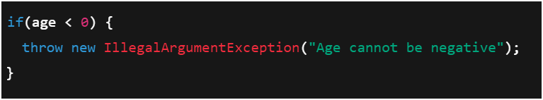

> **Explanation:** Here, if age is negative, we **throw** an exception immediately to stop execution and inform the caller about the problem.

## What is `throws`?
✅ **Use:**
`throws` is used in the **method declaration** to say: "⚠️ This method **might throw this type of exception**, so whoever calls it should handle it."

🔧 **Why? (Use cases)**
To **inform the compiler and programmer** that this method could throw an exception, and it is **not handling it inside itself**.

📌 **Example:**
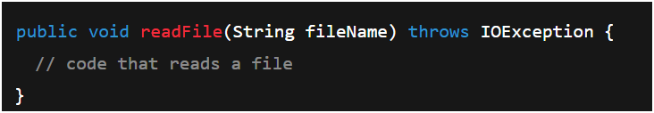

> **Explanation:** This says "I am not handling `IOException` inside this method, so whoever calls `readFile()` must handle or declare it."

## What is `finally`?
✅ **Use:**
`finally` is a block that **always runs** after `try` (whether an exception happens or not).

🔧 **Why?**
To **clean up resources** like closing files, releasing database connections, etc.

📌 **Example:**
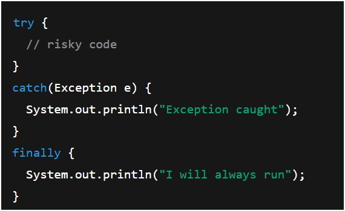

> **Explanation:** No matter if an exception is thrown or not, the **`finally` block runs**.

| Keyword   | Use                                           | Meaning                                               |
| --------- | --------------------------------------------- | ----------------------------------------------------- |
| `throw`   | Actually **throws an exception**              | "I am throwing an error now."                         |
| `throws`  | **Declares** that a method can throw an exception | "This method might throw this error, caller handle it." |
| `finally` | Always runs after try-catch                   | "For Cleanup! Code here always runs."                 |

## What are Custom Exceptions?
**Explanation:**
-   Java has built-in exceptions like `ArithmeticException`, `IOException`, etc.
-   Sometimes, you want to create your **own exception class with meaningful names** to handle specific situations in your program.

✅ **How?**
-   Create a class extending `Exception` (checked) or `RuntimeException` (unchecked).

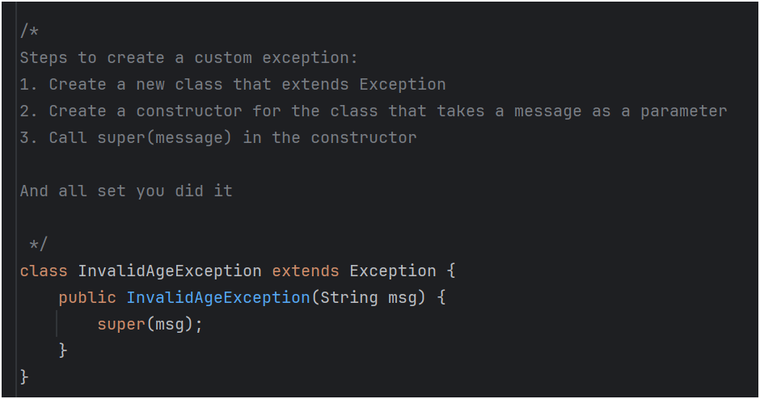
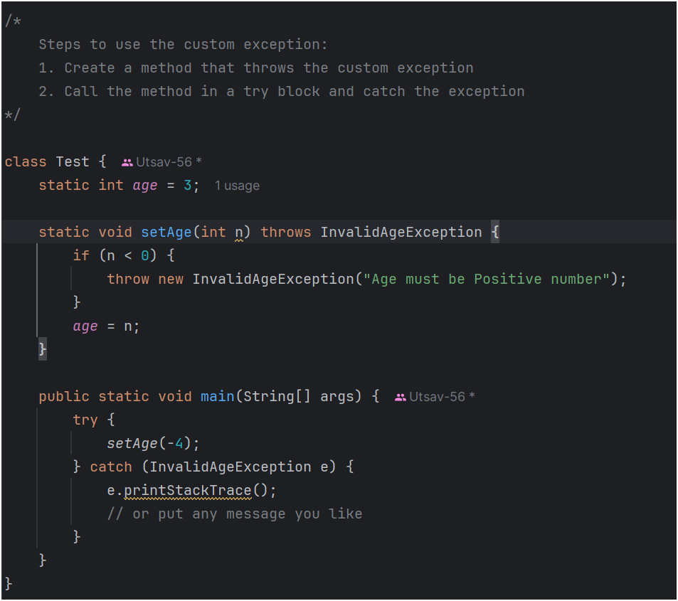
> **Explanation:**
> 1.  `InvalidAgeException` is a **custom exception class**.
> 2.  The `setAge` method **throws** it if the number is negative.
> 3.  `main` catches and handles it.

## What are Multiple Catch Blocks?
**Explanation:**
-   You can have **multiple `catch` blocks** to handle **different types of exceptions** separately.
-   The first matching `catch` block executes.

**Program: Multiple Catch Blocks**
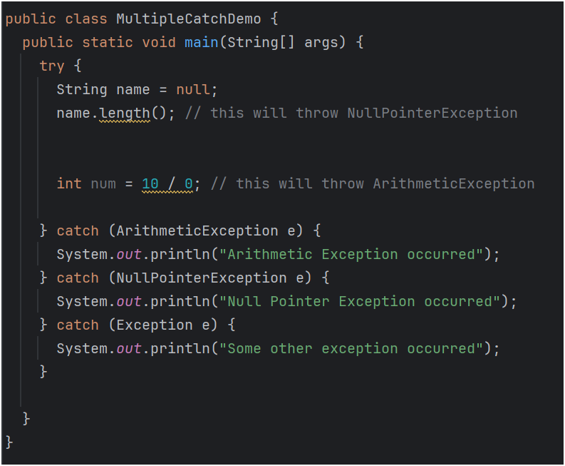
> **Explanation:**
> 1.  **First error:** `name.length()` causes `NullPointerException`.
> 2.  The **first exception is caught** and handled here, so division by zero does not occur because the line below the error does not execute.

## Why is Exception Handling Important?
1.  **Prevents program from crashing suddenly**
    > Without handling, if an error occurs, the program **stops immediately**.
2.  **Helps identify and handle errors gracefully**
    > You can **show meaningful messages to the user** instead of confusing errors.
3.  **Allows the program to continue or shut down properly**
    > You can decide whether to **continue execution or exit safely**, releasing resources.
4.  **Helps in debugging**
    > You know **where and why** an error happened.

> **Real-life example:** Imagine an ATM machine code. If it crashes due to a small input error without handling, the machine will stop working for everyone. Exception handling ensures a **smooth user experience even in errors**.

## `try-catch-finally` Explained
-   **`try` block:** Contains **code that might cause an exception**.
-   **`catch` block:** Contains **code to handle that exception** if it occurs.
-   **`finally` block:** Contains **code that always runs**, whether an exception occurs or not (e.g., closing files).

**Example Program:**
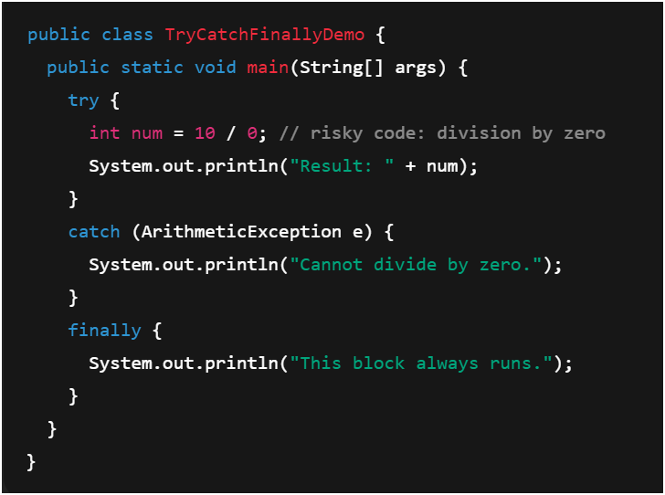

## Checked vs Unchecked Exceptions

### 1. Checked Exceptions
> **Definition:** Exceptions that are **checked at compile time**.
-   ✔️ The compiler **requires you to handle them**, either with `try-catch` or by declaring with `throws`.
-   🔷 **Examples:** `IOException`, `SQLException`, `FileNotFoundException`.
-   📌 **Why?** Because they are **expected to happen** during normal program execution (e.g., file not found, network issues) and you should **prepare for them**.

### 2. Unchecked Exceptions
> **Definition:** Exceptions that are **not checked at compile time**.
-   ✔️ The compiler **does NOT force you to handle them.**
-   🔷 **Examples:** `ArithmeticException`, `NullPointerException`, `ArrayIndexOutOfBoundsException`.
-   📌 **Why?** These are mostly **programming errors** or **logic mistakes** that can be prevented by writing correct code.

| Feature         | Checked Exception                             | Unchecked Exception                       |
| --------------- | --------------------------------------------- | ----------------------------------------- |
| **When checked?** | At **compile time**                           | At **runtime** only                       |
| **Handling?**   | **Yes**, must handle or declare with `throws` | **No**, not mandatory                     |
| **Examples**    | `IOException`, `SQLException`                 | `ArithmeticException`, `NullPointerException` |
| **Type**        | Subclass of `Exception`                       | Subclass of `RuntimeException`            |

## `throw` vs `throws`

| Feature              | `throw`                                          | `throws`                                               |
| -------------------- | ------------------------------------------------ | ------------------------------------------------------ |
| **Purpose**          | **Actually throws an exception**                 | **Declares that a method might throw an exception**    |
| **Usage**            | Inside a method or block                         | In the method signature                                |
| **Number of exceptions** | Can **throw only one exception at a time**     | Can **indicate multiple exceptions**, separated by commas |
| **Example**          | `throw new ArithmeticException("Invalid");`     | `public void f() throws IOException, SQLException;`  |

## What `throws` Actually Does
> In Java, the `throws` keyword is used in a **method signature** to indicate that the method **might cause** one or more exceptions. It doesn't throw anything itself — it just **signals** that the method doesn't handle those exceptions internally.

**Example:**
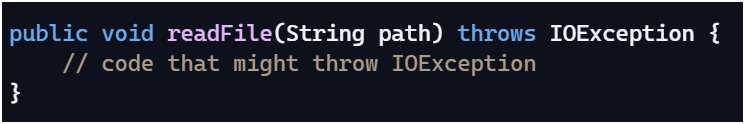

> This tells the compiler and the caller: **"I'm not catching this exception here — you need to handle it."** The caller must then handle it gracefully using `try-catch`.

***

# Multithreading

## What is Multithreading?
> ✅ **Definition:** Multithreading is a **feature that allows multiple parts of a program (threads) to run at the same time** to perform tasks concurrently.

✔️ **Why use it?**
-   To **make programs faster** (e.g., downloading files while updating UI).
-   To **perform multiple tasks simultaneously** (e.g., audio + video playing together).

> 🔷 **Real-life example:** Using your phone while downloading apps in the background — **both tasks run together without waiting for each other to finish**.

## How is Multithreading implemented in Java?
There are **two main ways**:

### 1. Extending the `Thread` class
📌 **Steps:**
1.  Create a class that **extends `Thread`**.
2.  Override the **`run()` method** with the code you want to execute in the thread.
3.  Create an object of your class and call **`start()`** to begin the thread.

**Example:**
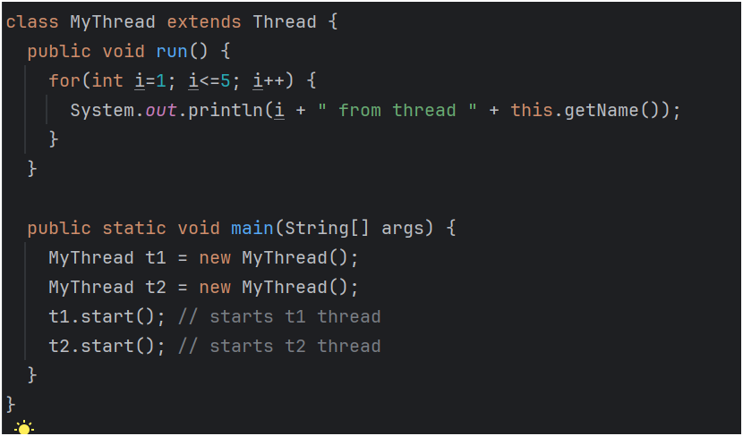

### 2. Implementing the `Runnable` interface
📌 **Steps:**
1.  Create a class that **implements `Runnable`**.
2.  Override the **`run()` method**.
3.  Create a `Thread` object, passing your class object to its constructor, and call **`start()`**.

🔧 **Example:**
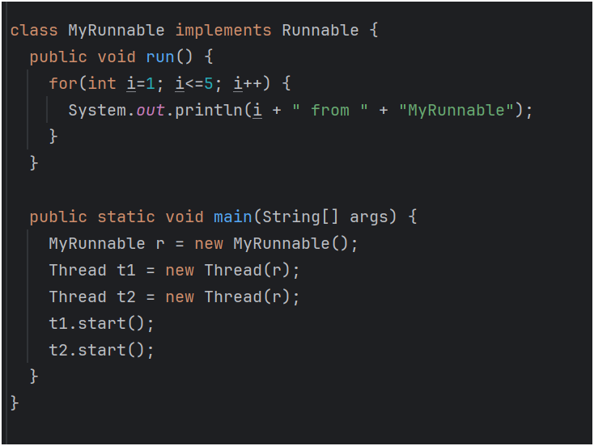

## What is synchronization in multi-threading in java ?
> ✅ **Definition:** Synchronization is a **mechanism to control access to shared resources by multiple threads** to prevent **data inconsistency**.

🔧 **Why is it needed?**
> When two or more threads access **the same data at the same time**, they might **change its value unexpectedly**, leading to **wrong results (race condition).**

> 🎯 **Real-life example:** Imagine **two people withdrawing money from the same bank account at the same time**. Both might see the same balance and withdraw, leading to a negative or incorrect final balance. Synchronization ensures only one person (thread) can access the account at a time.

## How to implement synchronization in Java?
📌 **Using the `synchronized` keyword:**
1.  **`synchronized` method:** Only one thread can execute the method on an object at a time.

**Example:**
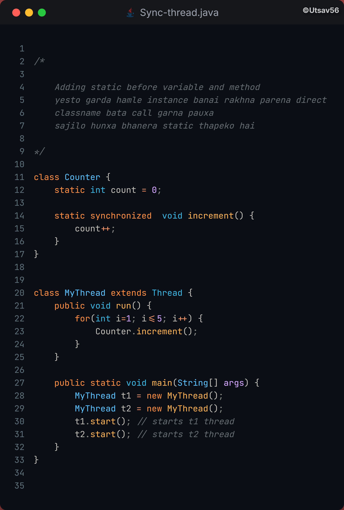

## What is Inter-Thread Communication?
> ✅ **Definition:** Inter-thread communication allows **threads to communicate with each other** (cooperation), rather than working independently.

**Why?**
> To **avoid busy waiting** (when a thread keeps checking a condition repeatedly, wasting CPU). It enables threads to **wait** for each other and **notify** when ready.

> **Example: Producer-Consumer problem**
> -   **Producer:** Produces items and adds them to a queue.
> -   **Consumer:** Consumes items from the queue.
> -   If the queue is full, the producer waits. If it's empty, the consumer waits. They **communicate using `wait()` and `notify()`**.

## Java Methods for Inter-thread Communication
-   `wait()`: Makes the thread **wait (pause) and release its lock**, until another thread calls `notify()` or `notifyAll()`.
-   `notify()`: **Wakes up one waiting thread**.
-   `notifyAll()`: **Wakes up all waiting threads**.

| Concept                       | Meaning                                     | Why?                                        |
| ----------------------------- | ------------------------------------------- | ------------------------------------------- |
| **Synchronization**           | Controlling thread access to shared resources | To **avoid data inconsistency**             |
| **Inter-thread communication**| Threads communicate via `wait()`/`notify()` | To **coordinate work between threads efficiently** |

***

# Inheritance

## What is Inheritance?
> ✅ **Definition:** Inheritance is a feature of **Object-Oriented Programming (OOP)** where a **new class (child/subclass)** can **acquire properties and methods** of an **existing class (parent/superclass)**.

### 🎯 Why is inheritance useful?
✔️ **Code Reusability:** No need to write the same code again.
✔️ **Improves Readability:** Clear relationship between classes.
✔️ **Supports Hierarchical Classification:** Like a real-world family tree.

> **✅ Real-life example:**
> -   **`Animal` (superclass)** → has basic features like `eat()`, `sleep()`.
> -   **`Dog` (subclass)** → inherits `eat()`, `sleep()` from `Animal`, and adds its own `bark()`.

### 🌟 Features of Inheritance
-   🔷 **1. Reusability:** Reuse existing code from the parent class.
-   🔷 **2. Extensibility:** Extend features of the parent by adding new features in the child.
-   🔷 **3. Data Hiding:** Child class can't directly access `private` data of the parent.
-   🔷 **4. Overriding:** Child class can override parent methods to provide a specific implementation.
-   🔷 **5. Hierarchical classification:** One parent can have multiple child classes.

> **🌟 How is Inheritance implemented in Java?**

1. **Using the `extends` keyword.**

**Example Program**
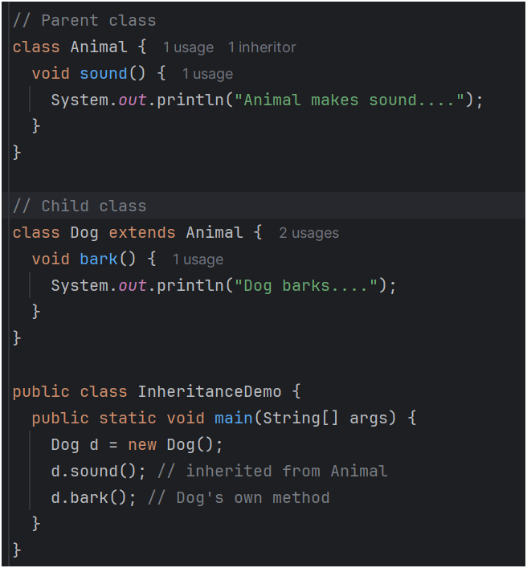

| Type         | Supported in Java?                         | Example      |
| ------------ | ------------------------------------------ | ------------ |
| **Single**   | ✅ Yes                                     | A → B        |
| **Multilevel**| ✅ Yes                                     | A → B → C    |
| **Hierarchical**| ✅ Yes                                     | A → B, A → C |
| **Multiple** | ❌ No (directly, but via interfaces)       | A, B → C     |
| **Hybrid**   | ❌ No (directly)                           | Combination  |

## Extends keyword
✅ **What is it?**
-   The `extends` keyword is used to **create a subclass from a superclass**.
-   It establishes an **inheritance** relationship between two classes.

🔧 **Where is it used?**
In the **class declaration line**:

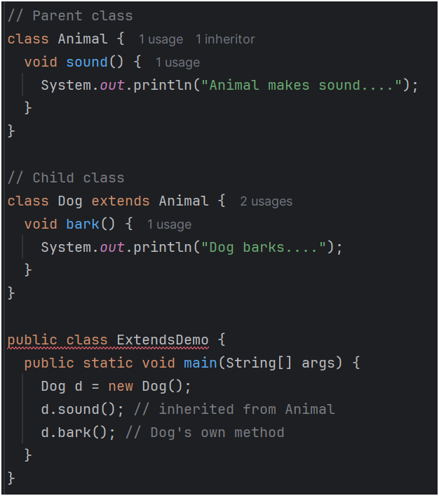

## super keyword
### What is it?
-   `super` refers to the **parent class (superclass) object**.
-   It is used to:
    -   **a) Access parent class variables and methods.**
    -   **b) Call the parent class constructor.**

### a) Accessing parent method or variable

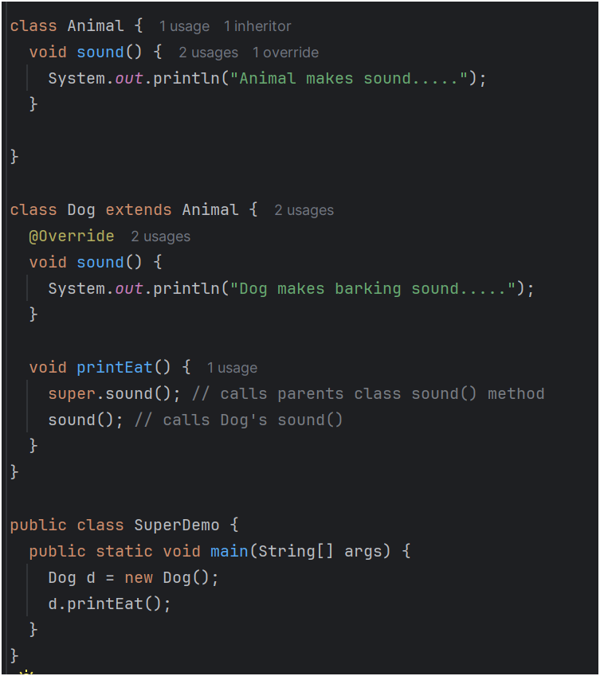

> **Explanation:**
> -   `super.sound();` calls the **parent class's method**.
> -   `sound();` calls the **current class's method**.

### b) Calling parent class constructor
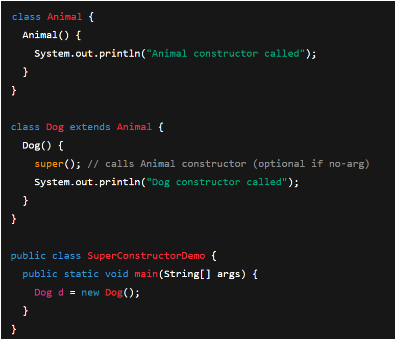

> ✔️ **Explanation:**
> -   `super();` calls the `Animal`'s constructor before executing the `Dog`'s constructor body.

| Keyword   | Purpose                                               | Usage                             |
| --------- | ----------------------------------------------------- | --------------------------------- |
| **extends** | To **inherit** from a parent class                    | `class B extends A { }`           |
| **super**   | To **refer to the parent class's members** or constructor | `super.methodName();` or `super();` |

## Types of Inheritance

### 1. Single Inheritance
✔️ **One child inherits from one parent.**
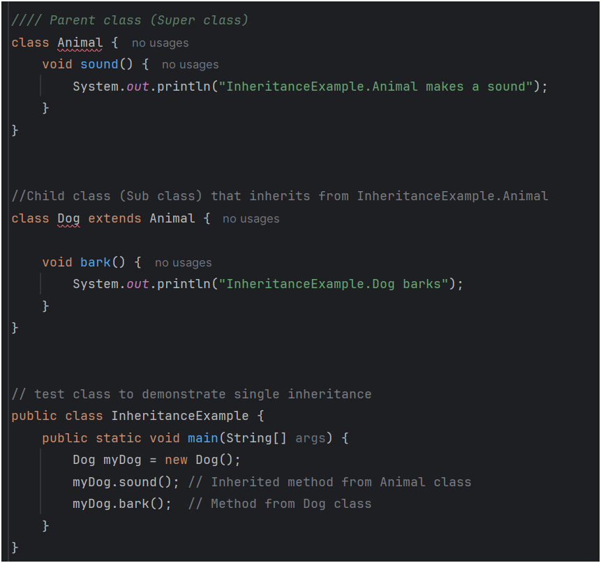

### 2. Multilevel Inheritance
✔️ **A chain of inheritance.** (A class extends a child class).

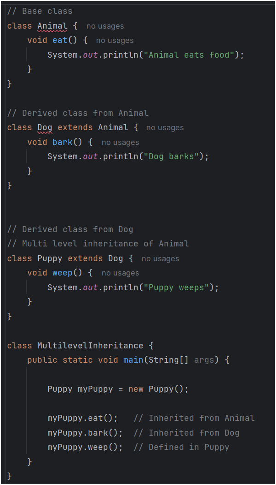

> **Explanation:** `Dog` inherits from `Animal`, and `Puppy` inherits from `Dog`.

### 3. Hierarchical Inheritance
**✔️ One parent, multiple children.**

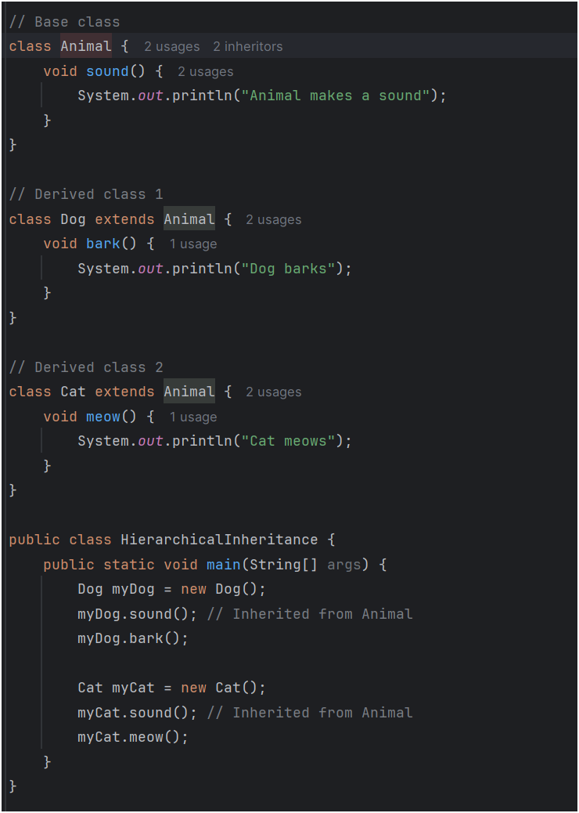

***

# Polymorphism

## What is Polymorphism?
> ✅ **Definition:** Polymorphism is an **Object-Oriented Programming (OOP) concept** where the **same function or object behaves differently** in different situations.
> **Meaning:** "**One name, many forms.**"

> **🎯 Real-life example:**
> -   A person acts as a **student in class**, a **child at home**, and a **friend outside**.
> -   **Same person, different behaviors** based on the context.

## Types of Polymorphism in Java
-   ✅ **1. Compile-time polymorphism (Method Overloading)**
-   ✅ **2. Runtime polymorphism (Method Overriding)**

### 1. Compile-time Polymorphism (Method Overloading)
> 🔷 **What is it?** When **multiple methods have the same name but different parameters** (different type or number of arguments).
> ✔️ The correct method to call is **decided during compile time**.

**Example:**

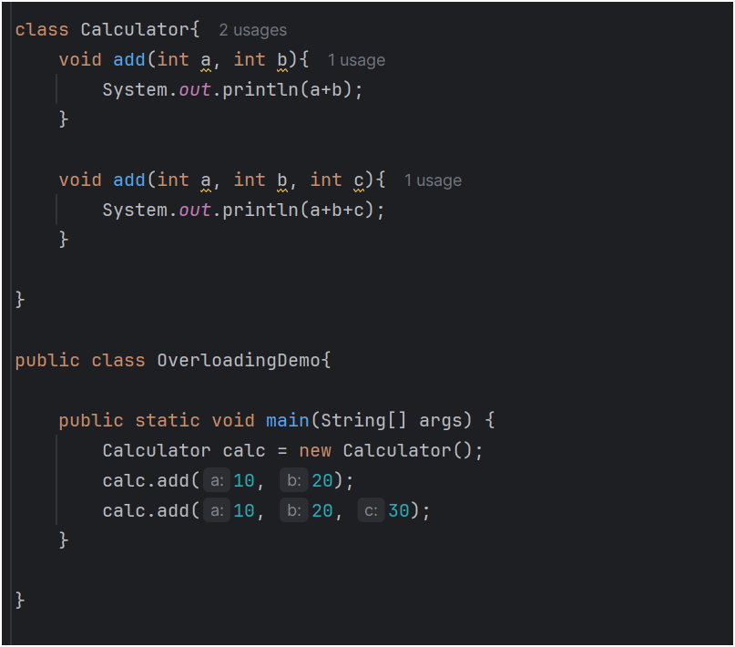

> **Explanation:** The same method name `add` is used with **different parameters**.

### 2. Runtime Polymorphism (Method Overriding)
> 🔷 **What is it?** When a **child class provides its own implementation** of a method that is already defined in its parent class.
> ✔️ The correct method to call is **decided during runtime**.

**Example:**

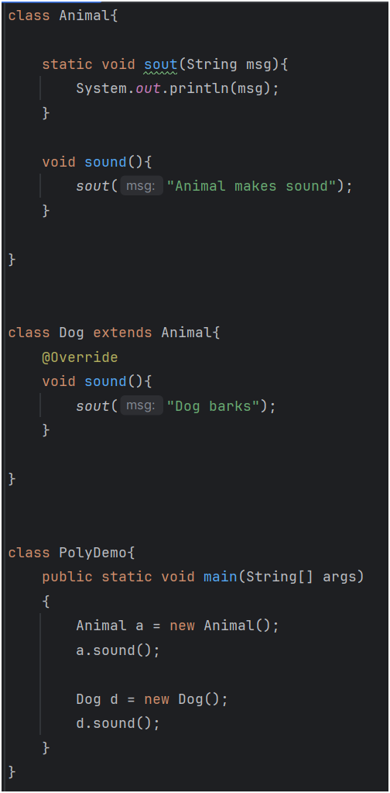

| Type of Polymorphism | How achieved?           | When decided?   |
| -------------------- | ----------------------- | --------------- |
| **Compile-time**     | **Method Overloading**  | **Compile time**|
| **Runtime**          | **Method Overriding**   | **Runtime**     |

***

# Abstraction
> The concept of **hiding complex implementation details** and showing only the **essential features** of an object is called abstraction.

## What is an Interface in Java?
> ✅ **Definition:** An interface in Java is like a **blueprint of a class**. It contains **abstract methods** (method declarations without a body).

**Purpose:**
-   ✔️ To achieve **abstraction**.
-   ✔️ To achieve **multiple inheritance** (since Java doesn't support it with classes).
-   ✔️ To define **what a class must do**, not how it must do it.

## Difference between Class and Interface

| Feature            | Class                                            | Interface                                        |
| ------------------ | ------------------------------------------------ | ------------------------------------------------ |
| **Keyword used**   | `class`                                          | `interface`                                      |
| **Members**        | Can have variables, constructors, concrete methods | Can have abstract methods (without body)         |
| **Implementation** | Defines **how** things work (implementation)     | Defines **what** to do (specification)         |
| **Inheritance**    | Can `extend` only one class                       | Can `implement` multiple interfaces                |
| **Instantiation**  | Can create objects                               | **Cannot** create objects directly             |
| **Constructor**    | Has constructors                                 | Has **no** constructor                         |

> **Memory Tip:**
> ✔️ **Class = implementation (how)**
> ✔️ **Interface = specification (what)**

## How are abstract classes different from regular classes?

| Feature         | Abstract Class                             | Regular Class                 |
| --------------- | ------------------------------------------ | ----------------------------- |
| **Instantiation** | **Cannot** be instantiated                 | Can be instantiated           |
| **Abstract methods**| Can have abstract methods                  | **Cannot** have abstract methods |
| **Purpose**     | To provide a partial implementation base     | To provide a full implementation |
| **Keyword**     | Declared with the `abstract` keyword       | No special keyword needed     |

## Difference between Abstract Class and Interface

| Feature        | Abstract Class                               | Interface                                        |
| -------------- | -------------------------------------------- | ------------------------------------------------ |
| **Methods**      | Can have **abstract and concrete methods**   | All methods are **abstract by default** (pre-Java 8) |
| **Variables**    | Can have **instance variables**              | Can only have `public static final` constants    |
| **Inheritance**  | A class can `extend` only one abstract class | A class can `implement` many interfaces          |
| **Constructors** | Can have constructors                        | **No constructors**                              |
| **Use-case**     | When classes share common behavior         | To define a pure **abstraction contract**        |

> **Memory Tip:**
> ✔️ **Abstract class = partial abstraction + implementation**
> ✔️ **Interface = full abstraction (contract only)**

## Why is Multiple Inheritance not supported directly in Java?
> ✅ **Multiple inheritance:** When a class **inherits from more than one parent class**.

**The Diamond Problem:**
> It creates **ambiguity** if two parent classes have methods with the same signature. If `Class C` inherits from `Class A` and `Class B`, and both have a `show()` method, which one should `C.show()` call?

**Java's Solution: Interfaces**
-   ✔️ Java **achieves multiple inheritance using interfaces** because interfaces only have method declarations (no implementation, pre-Java 8).
-   ✔️ The implementing class provides its **own implementation**, so there is **no ambiguity**.

## How to Implement Multiple Inheritance using Interfaces?
✅ **Steps:**
1.  Define **two or more interfaces**.
2.  Implement them in a **single class**, separated by commas.

**Example Program:**

## Example of abstract class

> **Explanation:**
> -   The class `Animal` is declared using the `abstract` keyword.
> -   It has both a concrete method (`eat`) and an abstract method (`sound`).
> -   `Dog` extends `Animal`, so it **must** provide an implementation for the `sound` method.

***

# File handling

## What is File Handling?
> ✅ **Definition:** File handling is the process of **creating, reading, writing, and modifying files** using a program.

🔷 **Why is it useful?**
-   ✔️ To **store data permanently**.
-   ✔️ To **read or write files** for data processing, reports, logs, etc.

### 🎯 Real-life examples of file handling:
-   Saving user data to a `.txt` file.
-   Reading configuration files for app settings.
-   Writing logs of transactions in banking systems.

## How is File Handling done in Java?
Java provides the **`java.io` package** for file handling.

### ✅ Basic File Handling Operations
1.  **Creating a File**
2.  **Writing to a File**
3.  **Reading from a File**
4.  **Deleting a File**

## Example Programs
**Before you start:**
1.  Import necessary classes like `java.io.File`, `java.io.IOException`, etc. (or just `java.io.*`).
2.  Wrap file operations in a `try-catch` block to handle `IOException`.

### Creating a new file

> **Explanation:**
> -   The `File` class is used to represent a file path.
> -   `createNewFile()` creates the file if it does not exist and returns `true`. If it exists, it does nothing and returns `false`.

### Writing to a file

> **Explanation:**
> -   `FileWriter` is used to write character streams to a file.
> -   The `write()` method writes the given text to the file.
> -   Always call `close()` to save the changes and release resources.

### Reading from a File

> **Explanation:**
> -   The `Scanner` class can be used to read from a file line by line.

### Delete a file

> **Explanation:**
> -   The `delete()` method deletes the file and returns `true` if successful.

| Operation | Class/Method Used       |
| --------- | ----------------------- |
| **Create**  | `File` + `createNewFile()` |
| **Write**   | `FileWriter` + `write()`   |
| **Read**    | `Scanner` + `nextLine()`   |
| **Delete**  | `File` + `delete()`        |

Of course. Here is the continued formatted markdown, including a new table of contents for these sections, with proper linking, styling, and the original images preserved.

## Copying content from one file to another
To copy content, you essentially read from a source file and write to a destination file simultaneously.

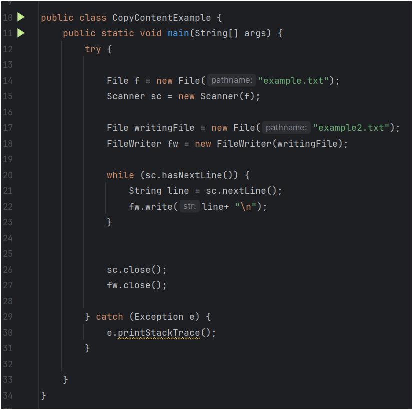

> **Explanation:**
> 1.  The logic is very similar to simply reading a file.
> 2.  Two additional lines are added to create a `FileWriter` instance for the destination file (`file2.txt`).
> 3.  Inside the `while` loop, instead of printing the content to the console with `System.out.println()`, we use `fw.write()` to write the content to the destination file.
> 4.  Finally, both the reader and the writer streams are closed.

# Serialization and Deserialization

## What is Serialization?
> ✅ **Definition:** Serialization is the process of **converting a Java object into a byte stream**. This byte stream can then be saved to a file or transferred over a network.

### Why do we need serialization?
> We need serialization because physical storage (files) and network protocols work with sequences of bytes, not directly with Java objects. Serialization acts as a translator.

## What is Deserialization?
> **Definition:** Deserialization is the reverse process: **converting a byte stream back into a copy of the original Java object**. It reconstructs the object from the saved data.

**🎯 Why are they important?**
✔️ **Persistent Storage:** Save the state of objects to files or databases for later use.
✔️ **Communication:** Send objects between different parts of an application or across a network (e.g., in distributed systems, sockets, Remote Method Invocation - RMI).

## How to implement Serialization in Java?
**Steps:**
1.  **Implement the `Serializable` interface** in the class whose objects you want to serialize. This is a "marker" interface, meaning it has no methods to implement.
2.  Use the **`ObjectOutputStream` class** to write the object to a byte stream.
3.  Use the **`ObjectInputStream` class** to read the object back from the byte stream.

> **Memory Tip:**
> -   **Serialization** → **Writing** an object → **`ObjectOutputStream`**.
> -   **Deserialization** → **Reading** an object → **`ObjectInputStream`**.

## Serialization Example

> **Explanation:**
> 1.  An object of the `Student` class (which must implement `Serializable`) is created.
> 2.  An `ObjectOutputStream` is created, linked to a `FileOutputStream` for `file.txt`.
> 3.  The `writeObject()` method is called to serialize the `student` object and write it to the file.
> 4.  The stream is closed to ensure all data is saved.

## Deserialization Example:

> **Explanation:**
> 1.  An `ObjectInputStream` is created, linked to a `FileInputStream` for the file containing the serialized object.
> 2.  The `readObject()` method is called. It reads the byte stream and reconstructs the object.
> 3.  The result from `readObject()` is cast back to the `Student` class.
> 4.  The data from the reconstructed object is printed to verify the process was successful.

# Streams in Java

## What are Streams in Java?
> **Definition:** Streams are sequences of data used to **perform input and output (I/O) operations** in Java. They provide a way to read from a source or write to a destination sequentially.

## Types of Streams

| Type             | Used for                                   |
| ---------------- | ------------------------------------------ |
| **Byte Stream**  | **Binary data** (images, videos, audio, PDF) |
| **Character Stream**| **Text data** (letters, words, sentences)    |

---

## Byte Streams
🔷 **What are they?**
-   Used to **read and write raw bytes (8-bit data)**.
-   Ideal for handling binary files where character translation is not needed.

🔧 **Core Classes:**
-   **`InputStream`**: Abstract class for reading bytes. (e.g., `FileInputStream`)
-   **`OutputStream`**: Abstract class for writing bytes. (e.g., `FileOutputStream`)

### Example: Reading a file using Byte Stream

## Character Streams
**What are they?**
-   Used to **read and write character data (16-bit Unicode characters)**.
-   Automatically handle the conversion between bytes and characters, making them suitable for text files.

**Core Classes:**
-   **`Reader`**: Abstract class for reading characters. (e.g., `FileReader`)
-   **`Writer`**: Abstract class for writing characters. (e.g., `FileWriter`)

### Example: Reading a File using Character Stream

> **Learning Tip:** The logic for reading a file with Byte Streams and Character Streams is nearly identical. The only significant difference is the classes you instantiate (`FileInputStream`/`FileOutputStream` vs. `FileReader`/`FileWriter`). If you understand one, you understand the other.

# Intro to Strings and String Buffers

## What are Strings in Java?
> **Definition:** A **`String`** in Java is a **sequence of characters**. It is an object of the `java.lang.String` class.

**Example:**
`String s1 = "Hello";`

Here, `"Hello"` is a **String literal**.

### How are Strings handled by the JVM?
-   In Java, String literals are stored in a special memory area called the **String Pool**.
-   When you create a String literal like `String s1 = "Hello";`, the JVM checks the pool. If "Hello" doesn't exist, it's created.
-   If you then create `String s2 = "Hello";`, the JVM finds "Hello" in the pool and makes `s2` point to the *same* object. No new object is created.
-   **Why?** This approach saves memory and increases performance.

## Why are Strings immutable in Java?
> **Meaning:** Once a `String` object is created, **its value cannot be changed**. Any modification (like concatenation) results in the creation of a *new* `String` object in the String Pool.

### Advantages of String Immutability
1.  **Thread Safety:** Since strings cannot be changed, they are inherently safe to be shared across multiple threads without needing synchronization.
2.  **Memory Efficiency:** The String Pool works because strings are immutable.
3.  **Security:** Immutable strings are safer to use for sensitive data like passwords or connection URLs, as their value cannot be altered after creation.

## What is StringBuffer in Java?
> **Definition:** `StringBuffer` is a class in Java used to **create mutable (changeable) strings**.

Unlike `String`, `StringBuffer` allows you to modify the content (append, insert, delete) without creating a new object each time, which is much more efficient for frequent modifications.

## Difference between String and StringBuffer

| Feature         | String                                   | StringBuffer                                |
| --------------- | ---------------------------------------- | ------------------------------------------- |
| **Mutability**  | **Immutable** (cannot be changed)        | **Mutable** (can be changed)                |
| **Performance** | Slower for many modifications            | Faster for many modifications               |
| **Memory**      | More memory usage with frequent changes  | Less memory usage (modifies the same object)|
| **Thread Safety** | **Thread-safe** (due to immutability)    | **Thread-safe** (methods are synchronized)  |
| **Use-case**    | When string content is fixed or rarely changes | When string content changes frequently in a multi-threaded environment |

> **🎯 Bonus: `StringBuilder`**
> `StringBuilder` is similar to `StringBuffer` (mutable) but is **not synchronized**. This makes it **faster** and the preferred choice for string manipulation in a **single-threaded environment**.

# String class

The `String` class provides many useful methods to perform operations like searching, modifying, comparing, and splitting strings.

## Common Methods of String Class

| Method                      | Description                                                  |
| --------------------------- | ------------------------------------------------------------ |
| `length()`                  | Returns the length of the string.                            |
| `charAt(int index)`         | Returns the character at the specified index.                |
| `equals(String s)`          | Checks if two strings are equal (case-sensitive).            |
| `equalsIgnoreCase(String s)`| Checks if two strings are equal (case-insensitive).          |
| `contains(CharSequence s)`  | Checks if the string contains the specified sequence of characters. |
| `compareTo(String s)`       | Compares two strings lexicographically.                      |
| `startsWith(String prefix)` | Checks if the string starts with the specified prefix.       |
| `endsWith(String suffix)`   | Checks if the string ends with the specified suffix.         |
| `toUpperCase()`             | Converts the string to uppercase.                            |
| `toLowerCase()`             | Converts the string to lowercase.                            |
| `trim()`                    | Removes leading and trailing whitespace.                     |
| `replace(char old, char new)`| Replaces all occurrences of a character.                     |
| `indexOf(char ch)`          | Returns the index of the first occurrence of a character.    |
| `substring(int begin, int end)`| Returns a substring from `beginIndex` to `endIndex - 1`.     |
| `split(String regex)`       | Splits the string around matches of the given regular expression. |

# What is the `static` keyword in Java?
> **Definition:** The `static` keyword is used to create variables and methods that belong to the **class itself, rather than to an instance (object) of the class**.

### Why use `static`?
-   To **share** a common property or method across all objects of a class (e.g., a counter).
-   To **access** methods or variables without needing to create an object of the class first (e.g., `Math.random()`).

### What can be `static`?

| Item                    | Explanation                                                              |
| ----------------------- | ------------------------------------------------------------------------ |
| **Static variables**    | Also called class variables. Shared by all instances of the class.       |
| **Static methods**      | Can be called using the class name. Can only access static members directly. |
| **Static blocks**       | A block of code that runs **once** when the class is first loaded by the JVM. |
| **Static nested classes** | A nested class that doesn't need an instance of the outer class to be created. |

# Iterator vs. Comparator vs. Comparable

## What is `Iterator` in Java?
> **Definition:** An `Iterator` is an interface in the `java.util` package used to **traverse (iterate over) the elements of a collection** one by one.

### Key Methods of `Iterator`:

| Method      | Description                                |
| ----------- | ------------------------------------------ |
| `hasNext()` | Returns `true` if there are more elements to iterate. |
| `next()`    | Returns the next element in the iteration. |
| `remove()`  | Removes the last element returned by `next()` from the collection. |

## What is `Comparator` in Java?
> **Definition:** A `Comparator` is an interface in the `java.util` package used to define a **custom sorting order** for objects. It allows you to specify sorting logic that is separate from the object's class.

### Key Method of `Comparator`:

| Method               | Description                                                        |
| -------------------- | ------------------------------------------------------------------ |
| `compare(T o1, T o2)`| Compares its two arguments for order. Returns a negative integer, zero, or a positive integer if the first argument is less than, equal to, or greater than the second. |

## Difference between `Iterator` and `Comparator`

| Feature   | Iterator                               | Comparator                           |
| --------- | -------------------------------------- | ------------------------------------ |
| **Purpose** | To traverse elements in a collection   | To define a custom sorting logic for objects |
| **Package** | `java.util`                            | `java.util`                            |
| **Usage**   | Iterate using `hasNext()` and `next()` | Implement `compare()` to sort objects|

## What is `Comparable` in Java?
> ✅ **Definition:** `Comparable` is an interface in the `java.lang` package used to define the **natural sorting order** of a class's objects. A class implements `Comparable` to indicate that its instances can be sorted.

### Key Method of `Comparable`:

| Method          | Description                                                        |
| --------------- | ------------------------------------------------------------------ |
| `compareTo(T o)`| Compares the current object (`this`) with the specified object for order. |

---

### `Comparable` vs. `Comparator`

| Feature           | Comparable                                        | Comparator                                     |
| ----------------- | ------------------------------------------------- | ---------------------------------------------- |
| **Package**       | `java.lang`                                       | `java.util`                                    |
| **Method**        | `compareTo(T o)`                                  | `compare(T o1, T o2)`                          |
| **Sorting Logic** | Defined **inside the class** whose objects are being sorted. | Defined **outside the class**, in a separate `Comparator` implementation. |
| **Usage**         | Defines the **natural (default)** ordering.       | Defines a **custom or alternative** ordering.  |
| **Sorting Options** | Provides a **single sorting sequence**.           | Provides **multiple different sorting sequences**. |

> **Final Tip:**
> -   Use **`Comparable`** when you want to define a single, natural default sorting order for a class (e.g., sorting employees by ID).
> -   Use **`Comparator`** when you need to sort objects in various different ways (e.g., sorting employees by name, then by salary, then by age).